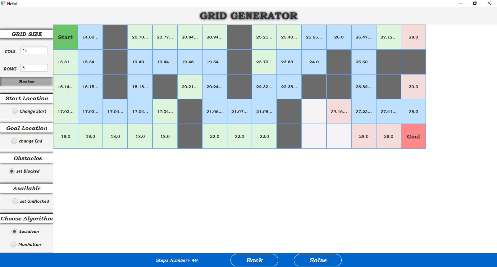

# Grid Solver

Grid Solver is an application that helps find the shortest path in a square grid with obstacles. The goal is to reach the target cell from the starting cell as quickly as possible. The implementation uses the A* Search Algorithm to efficiently find the optimal path.

## Technology

The project is developed using:

- Java
- JavaFX
- SceneBuilder

## Usage

To use Grid Solver, follow these steps:

1. Build the Grid:
   Enter the width and height to create the grid.

2. Define the Source and Target Cells:
   Locate the starting cell (source) and the target cell (goal) on the grid. Also, mark any blocked cells as obstacles.

3. Choose Heuristic Function:
   Select between Manhattan distance and Euclidean distance as the heuristic function.

4. Find the Shortest Path:
   Run the A* Search Algorithm to find the shortest path from the source to the target.

5. Visualization:
   The application will display the path (blue cells), tested cells (green cells), and expanded cells (purple cells) on the grid.

## Contributing

I welcome contributions to enhance Grid Solver and make it even more powerful.

## License

This project is licensed under the MIT License. Feel free to use, modify, and distribute it as per the terms of the license.

Best regards,  
Khaled Jeetan  
khalidgeetan@gmail.com    
Visit Profile [here](https://github.com/khaledJeetan/)